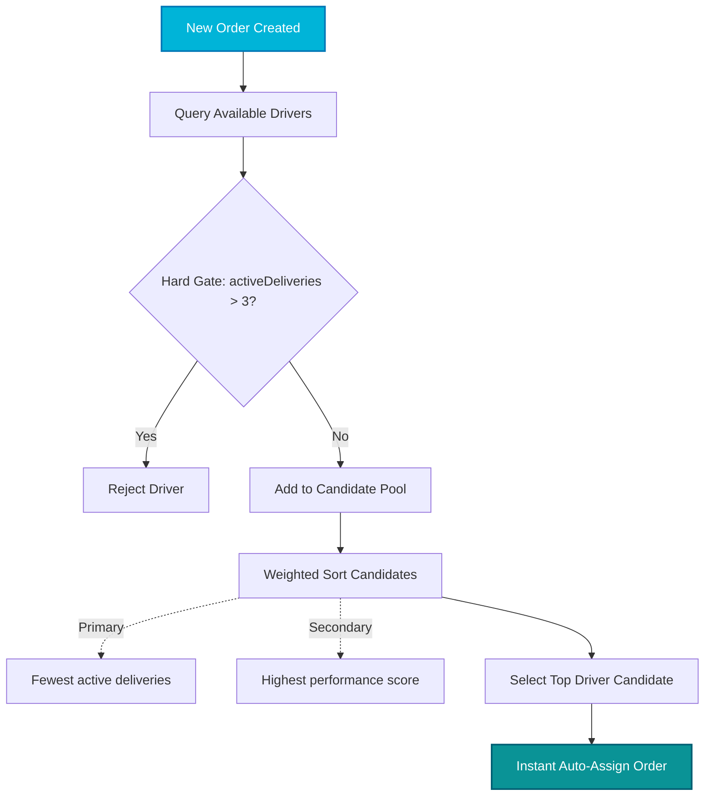

<div align="center">


**💧 Water Delivery, Reimagined for Bharat."**

[](https://opensource.org/licenses/MIT)
[](https://expo.dev/)
[](https://nodejs.org/)
[](https://www.mongodb.com/)
[](https://www.typescriptlang.org/)

An Enterprise SaaS Platform bridging local water can and jar delivery businesses with local consumers across India. Featuring real-time driver dispatching, glassmorphic UI, and complex role-based routing.

</div>

---

<details open>
<summary><b><h2>🏗 System Architecture</h2></b></summary>

```text
+-------------------+       +--------------------+       +-------------------+
|  Frontend (Expo)  |       |  Backend (Node.js) |       |  MongoDB Cluster  |
|                   |       |                    |       |                   |
| - Consumer App    | <===> | - Express API      | <===> | - Users / Roles   |
| - Driver App      |       | - Dispatch Logic   |       | - Orders & Fleet  |
| - Vendor App      |       | - JWT Auth         |       | - Metrics         |
+-------------------+       +--------------------+       +-------------------+
                                      ^
                                      |
                                      v
                            +--------------------+
                            |    AI Scheduler    |
                            |    (node-cron)     |
                            | - Daily Aggregation|
                            | - Token Flushing   |
                            | - Purge Stale Data |
                            +--------------------+
```
</details>

<details open>
<summary><b><h2>🚀 Tech Stack</h2></b></summary>

### 📱 Frontend Architecture
| Technology | Role | Details |
| :--- | :--- | :--- |
| **React Native** | Core Framework | Built with Expo SDK 52 |
| **Expo Router** | Navigation | File-based routing (`app/(role)/screen.tsx`) |
| **Reanimated 3** | Animations | 60fps native thread animations |
| **Expo Blur & Linear Gradient** | Styling | Premium glassmorphism UI |
| **Lucide React Native** | Iconography | High-quality SVG icons |
| **React Context + Axios** | State & Network | Lightweight API communication |
| **TypeScript** | Type Safety | Strict typing across 99.3% of the codebase |

### 🧠 Backend & Infrastructure
| Technology | Role | Details |
| :--- | :--- | :--- |
| **Node.js + Express** | Core Server | Configured for 10MB payload support |
| **MongoDB + Mongoose** | Database | Highly scalable document storage |
| **JWT + Bcrypt.js** | Authentication | Secure access and password hashing |
| **node-cron** | Task Runner | Scheduled background loops & AI |
| **express-async-handler** | Error Handling | Clean async controller management |
</details>

<details open>
<summary><b><h2>🤖 AI / Intelligence Layer</h2></b></summary>

### 📍 Dispatch Optimization Model (Visualized)
Our intelligent dispatch algorithm automatically matches orders to the optimal driver in real-time.



### ⏱️ Background Scheduler
The `ai/scheduler.js` runs silently via `node-cron` to maintain peak system health.

| Task | Frequency | Purpose |
| :--- | :--- | :--- |
| **Metric Aggregation** | Daily | Aggregates daily global delivery success rates |
| **Token Maintenance** | Hourly | Flushes expired JWT tokens to free up DB space |
| **Data Pruning** | Weekly | Purges stale historical metrics using retention windows |
| **Bias Prevention** | Monthly | Truncates legacy anomaly weights to prevent dataset bias |
</details>

<details>
<summary><b><h2>👥 User Roles & 📂 Project Structure</h2></b></summary>

JalSaathi offers 3 completely separate UI experiences seamlessly integrated into a single app binary:

1. 🛒 **Consumer**: Place orders, track delivery live on a map, and manage recurring subscriptions.
2. 🚚 **Driver**: Receive real-time dispatch alerts, navigate optimized routes, and track daily earnings.
3. 🏪 **Vendor**: Manage delivery fleets, view business analytics, and monitor revenue flows.

```text
JalSaathi/
├── Backend/
│   ├── models/           # Mongoose schemas
│   ├── routes/           # Express API endpoints
│   ├── middleware/       # JWT auth & error handlers
│   ├── ai/
│   │   └── scheduler.js  # node-cron background loops
│   ├── seed.js           # DB seeding script
│   └── server.js         # Entry point
└── Newproject/
    └── app/
        ├── (consumer)/   # Consumer specific screens
        ├── (driver)/     # Driver specific screens
        ├── (vendor)/     # Vendor specific screens
        ├── _layout.tsx   # Expo Router root layout
        └── index.tsx     # Role-based redirection logic
```
</details>

<details>
<summary><b><h2>🛠 Setup & Installation</h2></b></summary>

### Prerequisites
- Node.js (v18+)
- MongoDB instance (local or Atlas)
- Expo CLI (`npm install -g expo-cli`)

### 1. Clone & Configure Environment
```bash
git clone https://github.com/Sahil019/JalSaathi-App.git
cd JalSaathi
```

Create a `.env` file in the `Backend/` directory:
```env
MONGO_URI=mongodb+srv://<username>:<password>@cluster.mongodb.net/jalsaathi
JWT_SECRET=super_secret_jwt_key_here
JWT_EXPIRES_IN=7d
PORT=5000
NODE_ENV=development
```

### 2. Run the Backend
```bash
cd Backend
npm install
node seed.js        # Seeds the DB with user roles and mock data
node server.js      # Starts the server on http://localhost:5000
```

### 3. Run the Frontend
```bash
cd ../Newproject
npm install
npx expo start --clear
```
*Press `a` to run on Android emulator, `i` for iOS simulator, or scan the QR code with the Expo Go app.*
</details>

<details>
<summary><b><h2>📡 API Reference & 🎨 Design Guidelines</h2></b></summary>

### 📡 Core Endpoints
| Method | Endpoint | Auth Required | Description |
| :--- | :--- | :--- | :--- |
| `POST` | `/api/auth/register` | No | Register a new user (Consumer/Driver/Vendor) |
| `POST` | `/api/auth/login` | No | Authenticate user and receive JWT |
| `GET` | `/api/orders` | Yes | Get orders (scoped by user role) |
| `POST` | `/api/orders` | Yes | Create a new water delivery order |
| `PATCH` | `/api/orders/:id/status` | Yes | Update order status (Driver/Vendor) |
| `GET` | `/api/fleet` | Yes (Vendor) | View all drivers associated with a vendor |
| `GET` | `/api/analytics` | Yes (Vendor) | Retrieve revenue and performance analytics |

### 🎨 Design Rules
| Element | ✅ Do | ❌ Don't |
| :--- | :--- | :--- |
| **Colors** | Use `theme.background` and `theme.card` from `useColorScheme()` | Hardcode hex colors physically |
| **Backgrounds** | Use layered `expo-linear-gradient` with `expo-blur` (intensity 20-40) | Use flat, solid color backgrounds |
| **Interactivity** | Add `react-native-reanimated` spring or opacity feedback on press | Leave buttons static when tapped |
| **Iconography** | Use consistent, scalable `lucide-react-native` SVG icons | Use text labels or raster PNG icons |
| **Avatars** | Use the `<UserAvatar />` component with gradient fallbacks | Leave blank spaces if PFP is missing |
| **Theming** | Support system-wide seamless Dark Mode switching | Lock the app into light mode only |
</details>

<details>
<summary><b><h2>🤝 Contributing & 📄 License</h2></b></summary>

We welcome community contributions. To get started:

```bash
git checkout -b feature/amazing-feature
git commit -m "feat: Add amazing feature"
git push origin feature/amazing-feature
```

**Pull Request Checklist:**
- [x] Code follows TypeScript strict typing rules.
- [x] UI components pass the Design Guidelines (blur, reanimated, theme support).
- [x] Backend routes include `express-async-handler` wrappers.
- [x] No hard-coded colors or local host IPs.

This project is licensed under the [MIT License](https://opensource.org/licenses/MIT).
</details>

---

<div align="center">
  <p>Built with 💧 in India</p>
  <p><i>Bringing every drop to every doorstep — intelligently.</i></p>
  <br/>
  <a href="https://github.com/Sahil019/JalSaathi-App">
    
  </a>
</div>
