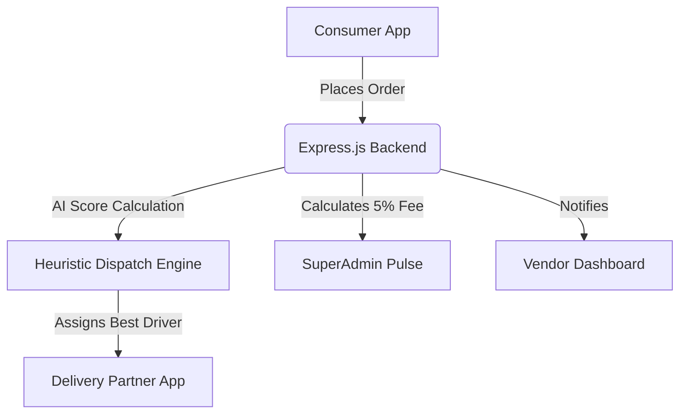

# 💧 JalSaathi — Smart Water Aggregator


**JalSaathi** is an enterprise-level SaaS platform uniting local water vendors, delivery drivers, and consumers around a single smart, automated digital ecosystem. It transforms fragmented local delivery ops into a Swiggy-like seamless experience.

---

## 🏗 System Architecture

The project splits into two deeply integrated repositories: 
- **The Brain (`Backend/`)**: An Express.js microservice architecture connected to MongoDB. Handles algorithmic assignments, JSON web tokens, continuous background cron jobs, and database seeding.
- **The Mobile Suite (`app/`)**: A massive React Native Expo Mono-repo that securely shifts UI/UX context based exclusively on the current user's authenticated role.



---

## 🧠 AI & Intelligent Logistics 

JalSaathi does not rely on heavy neural networks (like GPT or YOLO) which are battery/cost intensive. Instead, it uses **Real-time Heuristic Scoring Models** and **Pattern Analysis**.

### 1. The Dispatch Optimization Model
When an order is confirmed, the backend calculates the most optimal delivery boy using a heavily-weighted algorithmic sort:
1. **Workload Ceiling:** Rejects drivers with > 3 active deliveries (`status = "BUSY"`).
2. **Scoring Factor:** Sorts remaining available drivers based primarily on their active load (`activeDeliveries: 1` -> fewest active gets priority) and secondarily on their lifetime rating (`insights.performanceScore: -1` -> highest rating gets priority).
> *Result: Orders are auto-assigned instantly to the most reliable, least-stressed driver within the vendor's fleet.*

### 2. Scheduled Data Analysis Loop (`ai/scheduler.js`)
We run an asynchronous event-loop that systematically combs through the database without blocking the main event thread:
- Aggregates daily global delivery success rates.
- Actively flushes out expired tokens and irrelevant historical metrics using retention windows.
- Truncates dataset weights so future predicted models aren't biased by legacy anomalies.

---

## 💻 Complete Tech Stack

### Frontend (Mobile App)
- **Framework:** React Native + Expo (SDK Latest)
- **Routing:** Expo Router (File-based navigation: `app/(role)/screen.tsx`)
- **Animations:** `react-native-reanimated` (for 60fps native thread fluidity)
- **Styling:** Premium Glassmorphism (`expo-blur`), SVG Iconography (`lucide-react-native`), & `expo-linear-gradient`
- **State & API:** React `Context` + `Axios`

### Backend (Server API)
- **Runtime:** Node.js + Express.js
- **Database:** MongoDB + Mongoose Schemas
- **Security:** Bcrypt.js (Password Hashing) + JWT (JSON Web Tokens)
- **Utilities:** `node-cron` (For the AI Scheduler Loop) + `express-async-handler`

---

## 🎨 Frontend Design Guidelines

To maintain the JalSaathi premium aesthetic, any new screens MUST adhere to these Gen-Z/Modern UI principles:

1. **Vibrant & Dark-Mode Ready:** Use the `theme.background` and `theme.card` provided by our `useColorScheme` hook. Do not hardcode `#FFFFFF` or `#000000`.
2. **Visual Hierarchy:** Use `expo-blur` with `intensity={20-40}` to overlay information atop moving linear gradients rather than relying on flat, solid color blocks.
3. **Micro-Interactions Required:** Any interactive component (buttons, cards) must have active opacity drops or `react-native-reanimated` spring effects upon click.
4. **Imagery over Text:** Use `lucide-react-native` icons instead of long text explanations. 
5. **No Raster Avatars:** Users *must* use the `UserAvatar.tsx` element, which dynamically renders their uploaded profile picture, or gracefully falls back inside heavily saturated mathematical gradient borders if no picture exists.

---

## 🚀 Get Started

Ensure you have Node.js and the Expo CLI installed globally.

**1. Run the Backend API**
```bash
cd 'Backend'
npm install
node seed.js     # Provisions the DB with roles & mock data
node server.js   # Starts the Express server perfectly configured for 10MB payloads
```

**2. Run the Expo Mobile App**
```bash
cd 'Newproject'
npm install
npx expo start --clear
```
*Press `a` to run on Android Emulator or use the Expo Go app to scan the QR code.*
